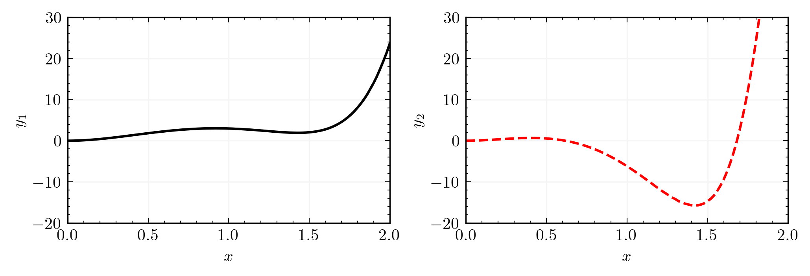
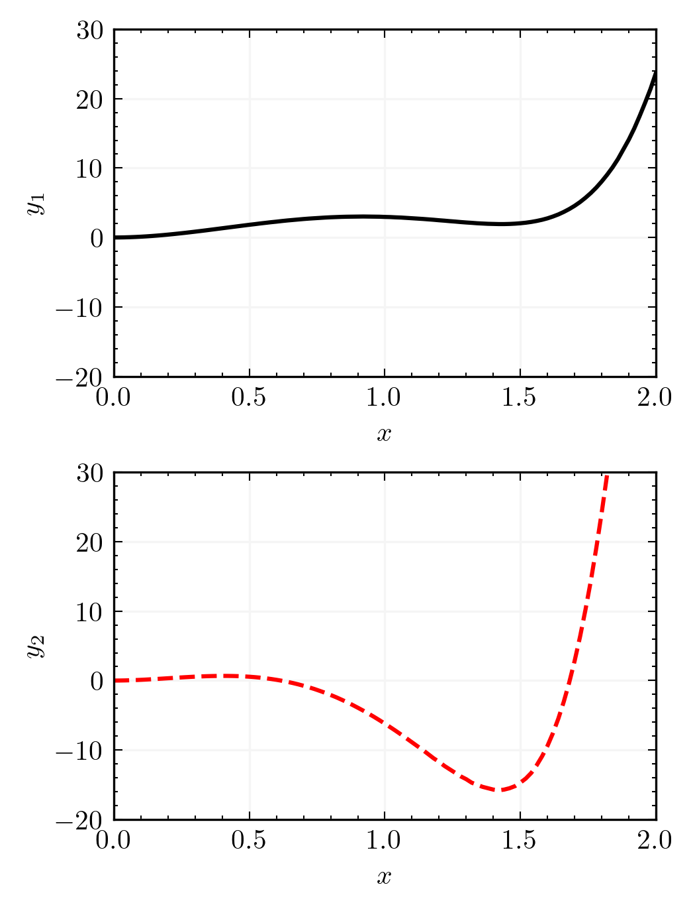

# matplotlib style file for beautiful scientific plots

* pre-requisites: latex

* to install: **bash install.sh**

* generate an example plot: **python example_plot.py**

* generate an example plot woth 2 columns: **python example_plot_2cols.py**

* generate an example plot woth 2 rows: **python example_plot_2rows.py**

