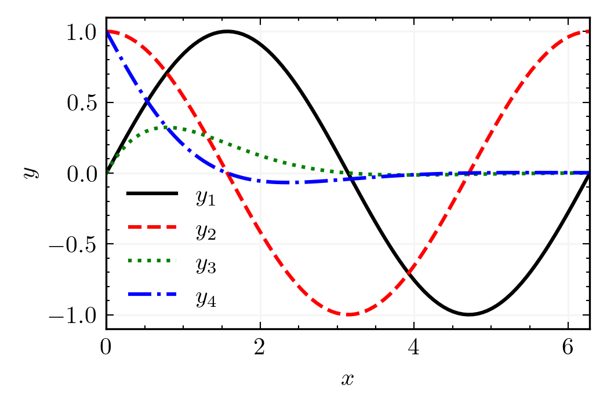
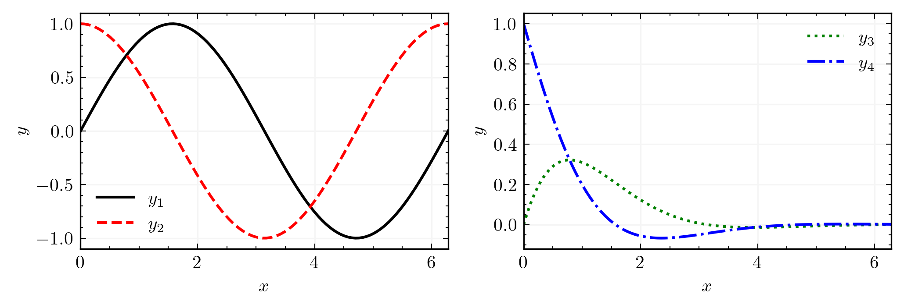
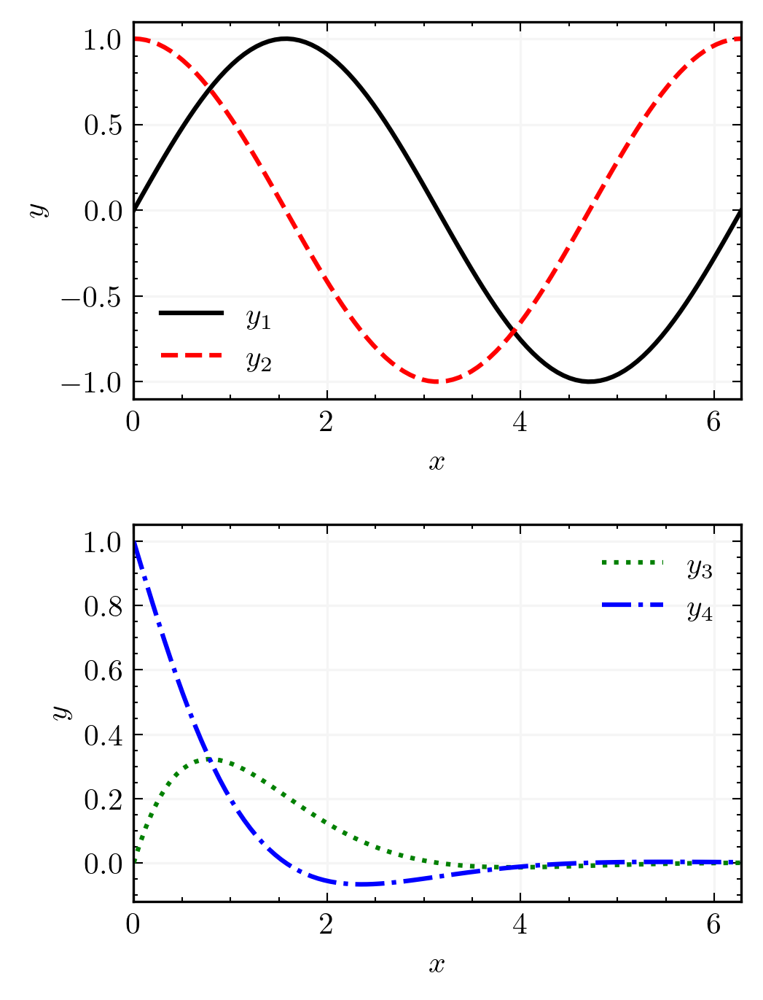
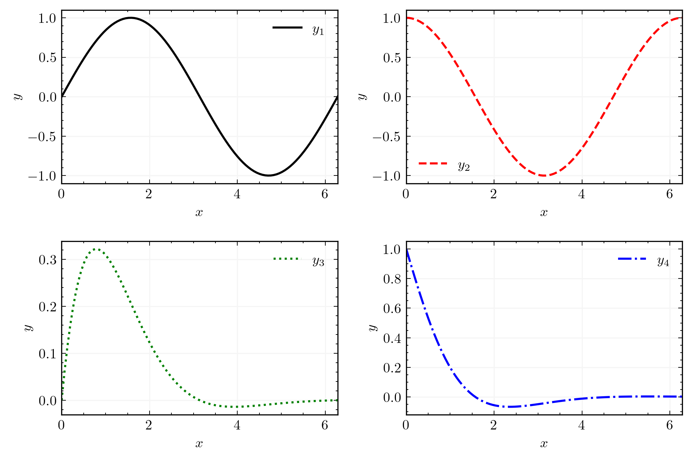

**matplotlib style file for scientific plotting**

* pre-requisites: LaTeX

* to install on Linux: **sh install_linux.sh**

* to install on MacOS: **sh install_mac.sh**

* generate an example plot: **python example_plot_1x1.py**

* generate an example plot with 2 columns: **python example_plot_1x2.py**

* generate an example plot with 2 rows: **python example_plot_2x1.py**

* generate an example plot with 2 rows and 2 columns: **python example_plot_2x2.py**
